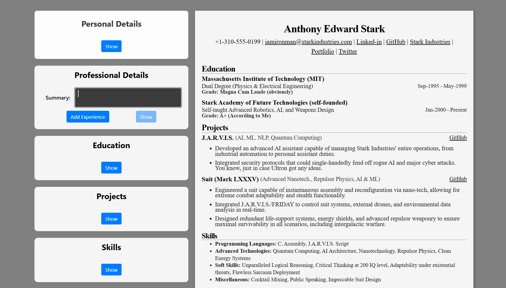

# CV-app

Check out the live preview : [Live Preview](https://cv-app-three-alpha.vercel.app/)

## Screenshots:

### On startup:

### Individual Fields can be edited and removed:

Here the experience field is removed completely

### Adding Bullet points:

Supports both adding new projects / jobs and adding new bullet points to individual projects / jobs.

## Finally

If you have any suggestions or find anything that can be improved upon, feel free to let me know, alternatively you can also [Raise an Issue](https://github.com/fromscode/cv-app/issues/new).

ggs! 👋
